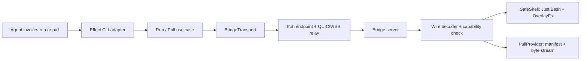

# dumbridge v1 design

Status: implemented prerelease; external release gates remain
Date: 2026-07-14

## Decision in one paragraph

dumbridge is a short-lived, read-only bridge from one local directory to a cloud coding agent. The user runs `dumbridge serve <root>` on their Mac, puts the resulting opaque bridge key in the cloud environment, and the agent uses `dumbridge run '<script>'` to explore the live directory with a safe Bash-shaped shell and `dumbridge pull <path>` to materialize only the files or directories it chooses. The local host never runs the real shell and never accepts filesystem writes. TypeScript owns the product, Bun owns the runtime, Effect v4 owns CLI/lifecycle, Just Bash owns the simulated shell, and the first `BridgeTransport` adapter uses Iroh for encrypted reachability. A tiny Rust change to the official Iroh Node-API binding is required to expose Iroh's existing HTTP-proxy support for Codex cloud.

## Product contract

> Give a disposable cloud agent temporary, live, read-only access to one local directory using commands it already understands.

The important word is **live**. `serve` does not upload or snapshot the root. An uncommitted file created after `serve` starts is visible to the next `run` or `pull` request.

The important boundary is **one served root**. The bridge does not expose the Mac, the user's home directory, or arbitrary absolute paths. It exposes one canonical directory for the lifetime of one foreground process.

The important direction is **local to cloud**. V1 does not write results back to the Mac. The agent can change its cloud checkout normally; dumbridge only lets it inspect and pull local context.

### Canonical terms

| Term | Meaning |
| --- | --- |
| **Served root** | The one canonical local directory visible through a running bridge. |
| **Bridge process** | The foreground `dumbridge serve` process. Stopping it ends access. |
| **Bridge key** | A secret, versioned bearer value containing a transport kind, opaque locator, random capability, and expiry deadline. |
| **Remote read shell** | Just Bash running against a copy-on-write view of the served root. It is not the Mac's real Bash. |
| **Run** | Execute one Bash-shaped query against the remote read shell and return bounded output. |
| **Pull** | Copy one selected file or directory from the served root into the cloud working directory. |

## The complete v1 interface

There are three bridge verbs plus one informational verb.

```text
dumbridge serve <root>
dumbridge run '<script>'
dumbridge pull <remote-path> [destination]
dumbridge skill
```

Running `dumbridge` with no verb shows help. `dumbridge skill` prints the bundled agent usage guide to stdout without contacting a bridge; it reads nothing, writes nothing, and does not change the read-only invariants. There is no `setup`, `connect`, `open`, `grant`, `audit`, `revoke`, `send`, or `receive` command in v1.

### `serve`

```bash
# Local Mac
bunx dumbridge serve ~/Documents/GitHub
```

`serve`:

1. resolves and canonicalizes the root;
2. starts one Iroh endpoint for the `dumbridge/1` protocol;
3. generates a new 32-byte random capability;
4. fixes the key expiry deadline from the configured TTL (default 8 hours, `--ttl '90 minutes'`);
5. prints a redacted summary plus a `DUMBRIDGE_KEY` value;
6. serves requests until Ctrl-C, rejecting sessions once the key expires;
7. closes the endpoint and forgets the capability on exit.

The root is required rather than defaulting to the current directory. Accidentally sharing the wrong directory is a worse failure than typing one extra argument.

The bridge stays attached to the terminal. V1 does not install a daemon. Ctrl-C is revocation.

### `run`

```bash
# Cloud agent
dumbridge run 'find . -path "*/SKILL.md" -print'
dumbridge run 'rg -n "Effect.Service" .agents | head -50'
dumbridge run 'file IMG2123.jpg; stat IMG2123.jpg; sha256sum IMG2123.jpg'
dumbridge run 'sed -n "1,240p" .agents/skills/wayfinder/SKILL.md'
```

`run` takes one quoted script string. This is both the cleanest agent interface and a workaround for the current Effect v4 beta parser, which does not reliably forward arbitrary operands following `--` into a subcommand.

The script is interpreted on the local machine by Just Bash, not by `/bin/bash`, PowerShell, `cmd.exe`, or a spawned host command. It can use familiar composition—`find`, `ls`, `cat`, `rg`, `grep`, `sed`, `awk`, `jq`, pipes, redirects, globs, and shell control flow—against a virtual root.

Writes made by the script go only to a fresh in-memory overlay and disappear after the request. `rm`, `mv`, `chmod`, and `>` therefore cannot mutate the served root. Overlay quotas charge attempted materialization and are not refunded within a request. Network access, Python, and JavaScript execution are disabled.

`run` returns stdout and stderr and exits with the remote shell's exit code. It is how an agent previews content before deciding what to pull; dumbridge does not invent separate `find`, `cat`, or `preview` APIs.

### `pull`

```bash
# Cloud agent
dumbridge pull .agents/skills/wayfinder
dumbridge pull apps/web/.env .env.local
dumbridge pull photos/IMG2123.jpg
```

`pull` accepts one remote relative path. It supports files and directories. It does not interpret shell syntax or globs; the agent uses `run` to discover the exact path first.

The receiver writes into a private staging path, verifies byte counts and digests, and only then exposes the destination. Existing destinations are refused. Symlinks are not followed in v1. A source file that changes while being transferred fails rather than silently producing a mixed version.

Binary stdout is not a separate v1 feature. The agent can inspect metadata or bounded bytes with `run`, then use `pull` when it needs the real file.

## What the agent actually does

For the prompt “grab the skill from my local Mac,” an agent should behave like this:

```bash
# 1. Discover candidates without copying anything.
dumbridge run 'find . -path "*/skills/*/SKILL.md" -print | sort'

# 2. Inspect the likely match in place.
dumbridge run 'sed -n "1,260p" .agents/skills/wayfinder/SKILL.md'

# 3. Pull the selected directory into the cloud workspace.
dumbridge pull .agents/skills/wayfinder .agents/skills/wayfinder
```

For an uncommitted `.env` and an ambiguously named image:

```bash
dumbridge run 'find . \( -name .env -o -iname "IMG*.jpg" \) -print'
dumbridge run 'file photos/IMG2123.jpg; stat photos/IMG2123.jpg; sha256sum photos/IMG2123.jpg'
dumbridge pull apps/web/.env .env.local
dumbridge pull photos/IMG2123.jpg
```

The CLI is the agent integration. An optional `SKILL.md` can teach these three commands to Codex, Claude Code, Cursor, or another harness, but the skill contains instructions only. It is not a runner, server, or protocol dependency. `dumbridge --help` must be sufficient for an unfamiliar agent.

## Why Just Bash is here

An allowlist such as “the host may run only `ls`, `cat`, and `rg`” sounds smaller, but it is not a security boundary. Every allowed native program brings its own flags, config discovery, filesystem behavior, subprocess behavior, and platform differences. Combining native programs through real Bash brings the entire host shell back into scope.

Just Bash gives dumbridge the useful part—the syntax and common tools agents already know—against an explicit filesystem object. Its `OverlayFs` reads the served root while retaining writes in memory, blocks path traversal, has symlink controls, and supplies execution/output limits. dumbridge still adds its own cross-platform security tests because Just Bash is beta and its upstream CI is not dumbridge's support contract.

Docker is deliberately absent. It would add a daemon, images, mounts, startup latency, and a second installation prerequisite merely to make a read-only query shell.

## Why Effect CLI is here

Effect CLI, Just Bash, and Iroh operate at different seams:

```text
effect/unstable/cli parses   dumbridge run '<script>'
Iroh transports             a typed Run request containing <script>
Just Bash parses            <script> against the served root
```

Use Effect v4's `effect/unstable/cli` with an exactly matched `@effect/platform-bun` beta. The executable ends in `BunRuntime.runMain`; it does not install `@effect/platform-node`. Do not install the standalone `@effect/cli`; that package is the Effect 3 line.

Effect earns its place beyond argument parsing: scoped endpoint cleanup, Ctrl-C interruption, connection supervision, request deadlines, retries, configuration, typed protocol failures, and test layers are real lifecycle concerns. The beta API stays behind the CLI adapter so a future parser change does not touch product primitives.

## Architecture



The architecture has five honest primitives.

### `ServedRoot`

Constructed once from a user-supplied path. It owns canonicalization, path containment, symlink policy, and sanitized display paths, and validates every remote path against the shared `RemotePath` grammar. It opens a fixed `/workspace` shell view and a pull-shaped `inspect` / `list` / `scan` view. The host path, Node handles, and `OverlayFs` policy never leave the module.

### `BridgeKey`

Mints, encodes, decodes, and validates a versioned transport-locator-plus-capability value. It hides Iroh ticket syntax—and any future hosted locator—from every command.

Conceptual payload:

```text
DumbridgeKeyV2 {
  version: 2
  transport: "iroh"
  locator: <opaque transport locator>
  capability: <32 random bytes>
  expiresAt: <epoch milliseconds>
}
```

Version 1 payloads, minted before keys carried a TTL, still parse; they have no
client-visible deadline. The expiry inside the payload is advisory, for clear
client errors: the serve process enforces the deadline it recorded at mint
time and never trusts a client-presented one.

Text form: `dumbridge1_<base64url-payload>`. It is an opaque capability string, not a browser URL. The served root is not encoded in it.

The stable contract is the envelope, not the Iroh locator. A future hosted adapter can use `transport: "https"` while preserving `serve`, `run`, `pull`, and the wire protocol. A friendly link such as `https://dumbridge.dev/b/<public-id>#<capability>` is possible later; keeping the capability in the URL fragment would prevent it from being sent to the web server during ordinary navigation. That is an illustrative future shape, not a v1 commitment.

### `BridgeTransport`

Owns endpoint lifetime, accept/connect, deadlines, close semantics, and backpressure. A finished send is not closed until Iroh confirms the peer acknowledged its bytes. Four bounded accept workers prevent one stalled handshake from blocking the listener. A client retries one failed connection once, before sending any request bytes; sent requests are never replayed. The Iroh adapter privately owns ALPN, direct versus relay paths, HTTP proxy configuration, and the current JavaScript/native byte conversion required by the Node-API binding. The public interface deals in bounded byte sessions, not Iroh classes.

The first production implementation uses `@number0/iroh`. Pure `Wire` sessions provide deterministic protocol tests, while direct-only Iroh loopback tests exercise scoped transport behavior without replacing it with a fake. A future HTTPS queue, if hosted proxies reject Iroh relay WebSockets, implements this interface without changing product commands, filesystem policy, or `dumbridge/1`.

### `Wire`

Owns `dumbridge/1`, length-prefixed frames, runtime decoding, version negotiation, maximum sizes, and response framing. Use Effect Schema for typed headers and raw binary payload frames for file bytes. Never base64 file contents into JSON.

One bidirectional stream serves one CLI invocation:

```text
request:  auth -> run | pull
run:      reject | (banner? -> stdout* -> stderr* -> exit)
pull:     reject | (manifest? -> (file-start -> file-chunk* -> file-end)* -> (complete | pull-error))
```

`pull-error` is a terminal, bounded code with no host path or cause. It may
replace the manifest or end a transfer after any earlier pull frame; the
receiver discards its private staging directory in either case.

`reject` is a terminal, bounded code (`invalid-key`, `expired-key`) that may
only replace an entire response, never end one that has started. The bridge
sends it after the constant-time capability comparison, so an unauthenticated
scanner still learns nothing beyond the ALPN it already knew. `banner` carries
the sanitized served-root display; the bridge sends it once, on its first run
response, and the schema refuses control characters so a hostile directory
name cannot inject terminal escapes into the client.

### `SafeShell` and `PullTransfer`

`SafeShell` constructs a fresh Just Bash/OverlayFs instance per request and returns a bounded command result. `PullTransfer` creates deterministic manifests below the served root, streams regular files, stages the destination, verifies it, and commits atomically. Neither knows how the bytes travel.

### Application surface

The use cases stay smaller than their implementations:

```ts
serve(root): Effect<never, ServeError, Scope>
run(key, script): Effect<RunResult, RunError>
pull(key, remotePath, destination): Effect<PullResult, PullError>
```

Iroh, Just Bash, Bun filesystem calls, and Effect CLI parsing remain adapters at the edges.

## Where Iroh works

Iroh hides:

- endpoint public-key identity;
- authenticated TLS 1.3 encryption;
- QUIC connections and multiplexed streams;
- NAT traversal and hole punching;
- relay discovery and encrypted relay fallback;
- address changes while a connection is alive.

dumbridge still owns authorization, filesystem policy, request framing, limits, pull manifests, and destination safety.

`serve` binds local ephemeral UDP sockets, but the user does not configure a router or expose a fixed public TCP port. Iroh attempts direct connectivity and falls back to an encrypted relay. In proxy-only environments the relay path is WSS over TCP/443.

Iroh is not a required paid service. The library and self-hosted relay software are open source, direct peer-to-peer connections do not incur an Iroh fee, and Iroh currently provides shared public relays for development and hobby use. Those public relays are rate-limited, have no SLA, expose connection metadata to the relay operator, and are not the production path for confidential material such as `.env` files. A production deployment can self-host a relay and pay only its infrastructure bill, or choose Iroh's paid managed relay service. dumbridge must keep that deployment choice inside the Iroh adapter.

### Why mint a bridge key

An Iroh endpoint ticket answers “which cryptographic endpoint and which network hints should I dial?” It is public address information, not permission. The random capability answers “may this caller use the one served root attached to this process?”

Without one opaque bridge key, v1 would need at least one of:

- an account and hosted registry;
- a permanent paired client identity;
- an interactive approval/PIN flow for every cloud task;
- a VPN/SSH setup;
- a separate rendezvous service.

For a stateless cloud agent, a short-lived bearer is the dumbest complete answer. Anyone who obtains it while `serve` is running has the same read access, so it must be scoped, short-lived, and redacted everywhere.

## Sendme, Dumbpipe, and `iroh-blobs`

V1 uses none of them as subprocesses or dependencies.

### What we borrow from Dumbpipe

Dumbpipe demonstrates the minimum Iroh connection shape: endpoint ticket, ALPN, accept/connect, and a bidirectional byte stream. Spawning it would still leave dumbridge to implement authentication, framing, limits, supervision, binary packaging, and every error boundary.

### What we borrow from Sendme

Sendme demonstrates the transfer invariants: canonical source paths, deterministic directory collections, safe relative export paths, staged downloads, missing-range recovery, digests, and cleanup. Spawning it would create a second endpoint, second ticket, temporary blob store, stale snapshot, and human-output parsing for every pull.

### Why not `iroh-blobs` yet

`iroh-blobs` is a good future answer for resumable, content-addressed, multi-gigabyte transfer. It is intentionally outside the stabilized Iroh 1.0 FFI surface, its current 0.103 line does not claim production quality, and a live file must still be snapshotted into its store before transfer. It does nothing for remote shell requests.

The direct native stream path must be benchmarked at 1 KiB, 10 MiB, and 1 GiB. Only if byte-copying or resumability becomes a demonstrated limit should dumbridge add a narrow Rust/N-API transfer adapter. The CLI and protocol should not be rewritten around Sendme.

## The one initial Rust change

The current `@number0/iroh` binding exposes endpoints, tickets, connections, and streams, but not Iroh's existing `Builder.proxy_url` or `Builder.proxy_from_env` methods. Codex cloud documents that all outbound traffic goes through an HTTP/HTTPS proxy. Unmodified `@number0/iroh` therefore cannot satisfy the documented Codex networking model.

Rust Iroh already supports exactly the needed path: relay packets travel over WSS, and the relay client can issue HTTP `CONNECT` through the configured proxy before TLS and WebSocket upgrade.

V1 should:

1. add `proxyUrl` and `proxyFromEnv` to a narrow fork of `iroh-ffi`;
2. open the same small change upstream;
3. build cloud keys with a relay-only endpoint address;
4. prove the flow in a real Codex cloud task;
5. stop carrying the fork as soon as an upstream release contains it.

Current Sendme and Dumbpipe binaries also omit `proxy_from_env`, so spawning them does not fix this.

If Codex's proxy rejects the WSS/`CONNECT` flow even after the binding is fixed, the fallback is an outbound HTTPS long-poll transport behind `BridgeTransport`, modeled on `openai/tunnel-client`. That would require a small hosted broker and is not authorized by guesswork; build it only after a real hosted-agent test fails.

## Security model

### We defend against

- internet scanners and callers who know only the public endpoint ticket;
- an untrusted remote shell script attempting to mutate or escape the root;
- `..`, absolute paths, NULs, path separator tricks, and root-escaping symlinks;
- oversized frames, output floods, infinite loops, idle streams, and connection floods;
- partial or corrupted pulls;
- accidental overwrite of cloud files;
- leakage of the bridge key through normal logs or error messages.

### We do not defend against

- a cloud agent or process that has the bridge key intentionally reading anything below the served root;
- a bridge key copied from the environment while the bridge is active;
- a compromised local user account reading the served root directly;
- a malicious local process rebinding a served path component and restoring its original identity entirely within one filesystem operation;
- denial of service that exhausts resources outside configured process limits;
- content already pulled into the cloud workspace after the local bridge stops.

### Required controls

- New random endpoint identity and capability per `serve` invocation.
- Key expiry deadline fixed at mint time and enforced by the serve process on every session.
- Constant-time capability comparison before parsing the request or touching the filesystem.
- One canonical served root; virtual paths never expose the real absolute Mac path.
- Verify the served root and accessed virtual-path component identities before and after every host-backed filesystem operation; discard the result and terminate the request if either changed.
- Just Bash `OverlayFs`, with no host subprocesses, network, Python, or JavaScript.
- Symlink following disabled in v1.
- Fresh overlay per request.
- Hard limits for handshake time, idle time, script length, command count, loop count, file reads, output, manifest entries, total pull bytes, concurrent connections, and concurrent pulls.
- Deterministic pull manifest; stage, hash, and atomically commit; refuse overwrite.
- Key redaction in structured logs, errors, telemetry, process titles, and test fixtures.
- Before a public release, enable GitHub private vulnerability reporting; exploit details never belong in public issues.

Just Bash 3.1's optional `defenseInDepth` box is deliberately disabled in the
v1 process. It freezes `Error.stackTraceLimit` process-wide during asynchronous
execution, while Effect 4 writes that property when it constructs effects; the
combination crashes unrelated concurrent fibers. This secondary upstream layer
is not part of dumbridge's security claim. V1 relies on the primary controls
above and keeps the incompatibility under a concurrent-fiber regression test.
Re-enable it only after an upstream compatibility fix or by isolating Just Bash
in a worker in a later version.

### Cloud credential reality

Codex environment variables exist during the agent phase, while Codex secrets are removed after setup. The CLI therefore needs `DUMBRIDGE_KEY` as an environment variable, not a Codex secret. Cursor secrets are injected as agent environment variables, which supplies the same bearer semantics. No design can let an agent invoke a bearer-authenticated CLI while making the bearer unknowable to every process acting as that agent.

The mitigation is scope: serve only the needed root, start immediately before the task, stop immediately after it, and keep v1 read-only. Serving the entire GitHub directory intentionally grants the key holder read access to every `.env` and uncommitted file below it.

## Runtime and tooling

| Decision | V1 choice | Reason |
| --- | --- | --- |
| Product language | TypeScript | Best fit for Effect, Just Bash, agent-facing CLI, and iteration speed. |
| Runtime and package manager | Bun, pinned | One runtime locally and in cloud agents; the canonical invocation is `bunx dumbridge`. |
| CLI/lifecycle | Effect v4 beta `effect/unstable/cli` + `@effect/platform-bun` | Typed commands, Bun services, and resource lifecycle; exact beta versions pinned together. |
| Shell | Just Bash | Bash-shaped agent UX over an explicit safe filesystem. |
| Transport | `@number0/iroh` 1.0 + temporary proxy-method fork | Direct official binding, smallest protocol, cloud proxy gap isolated. |
| Lint/format | Ultracite Biome `core` + separate `tsc --noEmit` | CLI-appropriate rules; no React/Next presets. |
| Releases | Changesets for versions and changelogs; publishing unconfigured | Do not copy or reuse any publisher setup. Add fresh npm publishing only after the owner creates it. |
| Workspace orchestration | Turborepo over a Bun workspace | Honor one task graph from day one and leave room for a native adapter or second app without reorganizing the repo. |

Bun is the published runtime, not merely the development package manager. The executable uses a Bun shebang and `BunRuntime.runMain`; `bunx dumbridge` is the supported zero-install path. `npx dumbridge` is not promised on a machine without Bun because npm can fetch a package but cannot supply its interpreter. A later Node bootstrap or standalone binary may improve installation ergonomics without changing the application.

Bun can load Node-API native addons and the current macOS arm64 Iroh package has passed a local smoke test under Bun. This is still a compatibility boundary: Iroh documents Node, while Bun promises broad rather than universal Node-API compatibility. CI must load and exercise the real addon on every promised platform before release.

File and directory pulls currently call each operating system's atomic no-replace rename through [`bun:ffi`](https://bun.sh/docs/runtime/ffi). Bun labels that API experimental, so it is a prerelease implementation boundary rather than part of dumbridge's stable interface. Before a stable release, either Bun must support that use as a production contract or the small publisher should move behind a Rust Node-API helper; the `PullTransfer` interface does not change.

## Repository shape

The repository is a Bun workspace orchestrated by Turborepo. The publishable CLI lives in `apps/dumbridge`; the internal seams live as private workspace packages under `packages/*` and are bundled into the single published `dist/cli.js` at build time.

```text
dumbridge/
├── .changeset/
├── .github/
│   ├── ISSUE_TEMPLATE/
│   ├── workflows/ci.yml
│   ├── CONTRIBUTING.md
│   └── SECURITY.md
├── apps/
│   └── dumbridge/            # CLI + serve/run/pull use cases
│       ├── src/
│       │   ├── cli.ts
│       │   └── bridge/       # server, client, channel glue
│       ├── test/
│       ├── package.json
│       └── tsconfig.json
├── packages/
│   ├── bridge-key/          # BridgeKey: mint, encode, parse, redact
│   ├── bridge-transport/     # BridgeTransport interface + iroh adapter
│   ├── remote-path/          # RemotePath: the one safe relative path grammar
│   ├── wire/                 # dumbridge/1 framing, sessions, manifests, limits
│   ├── served-root/          # ServedRoot: containment, views, budgets
│   ├── safe-shell/           # SafeShell: Just Bash per request
│   └── pull-transfer/        # PullTransfer: manifests, staging, commit
├── docs/
│   ├── design/v1.md
│   └── adr/
├── skills/dumbridge/         # agent skill printed by `dumbridge skill`
├── AGENTS.md
├── README.md
├── biome.jsonc
├── bun.lock
├── package.json
├── tsconfig.json
└── turbo.json
```

Use `create-mf2-app` as a hygiene donor, not a template to copy wholesale. Borrow restrictive npm packaging, pack verification, Changesets, CI structure, Dependabot, contribution docs, and templates. Do not copy publisher identity, release credentials, OIDC configuration, its SaaS workspace, web apps, React presets, template sync, or doctor.

The workspace packages are private and never published; npm consumers see only the self-contained `dumbridge` package. If a hosted HTTPS transport or separately built Rust adapter becomes real, it slots in as another adapter behind `@dumbridge/bridge-transport` without changing `serve`, `run`, or `pull`.

Do not copy its current security instructions: a filesystem bridge must direct vulnerability reports to a private channel.

## Platform promise

The support matrix is determined by published Iroh native packages and real CI, not by TypeScript alone.

| Platform | V1 position |
| --- | --- |
| macOS arm64 | Support and test. |
| macOS x64 | Do not promise; the official Iroh npm package has no Intel Mac binary. |
| Linux x64 glibc | Support and test. |
| Linux x64 musl | Support after native CI proves it. |
| Linux arm64 glibc/musl | Support after native CI proves it. |
| Windows x64 | Support and test. |
| Windows arm64 | Support after native CI proves it. |

Just Bash path, symlink, overlay, and atomic-destination behavior must be exercised on macOS, Linux, and Windows. “Works in TypeScript” is not evidence of cross-platform filesystem behavior.

## Provider setup

### Cursor Cloud Agent

Install dumbridge in the environment setup, store the short-lived key as a scoped Cursor secret, and allow the Iroh relay host. Cursor documents outbound network modes but does not promise UDP or WebSocket behavior, so the real hosted-agent test remains mandatory.

### Codex cloud

Install dumbridge during setup. During the agent phase:

- enable agent internet access;
- allow the exact relay host(s), because `iroh.link` is not in the common-dependencies preset;
- provide `DUMBRIDGE_KEY` as an environment variable;
- use the proxy-enabled Iroh binding and relay-only ticket.

The bridge is useful to Codex precisely because every cloud task starts from a repository checkout and configured environment rather than the user's live local filesystem. Codex container caching does not replace the bridge: the local capability remains valid only while `serve` is running.

## Release gates

V1 is not “the demo works on one Mac.” It is complete when all of these pass:

1. `bunx dumbridge --help` and `--version` work from the packed npm tarball on a clean Bun environment.
2. A real Mac provider and Linux cloud client connect over direct Iroh and forced relay.
3. A real Codex cloud task connects through the documented HTTP proxy with only the required relay domain allowed.
4. A real Cursor Cloud Agent connects under its documented network policy.
5. Wrong capability, malformed frame, idle stream, request timeout, output limit, and connection-limit tests fail closed.
6. The Just Bash shell reads live uncommitted data while all attempted writes disappear.
7. Root traversal, separator tricks, NULs, and symlink escape tests pass on macOS, Linux, and Windows.
8. File and directory pulls stage, hash, refuse overwrite, clean up on cancellation, and fail on source mutation.
9. Binary transfers at 1 KiB, 10 MiB, and 1 GiB record throughput and peak RSS; the supported-size claim follows the evidence.
10. The package loads the real Iroh native addon on every promised platform.
11. Turborepo drives check, typecheck, test, build, and pack verification in CI; Changesets validates version/changelog state, with no publish job or credentials configured yet.
12. The published tarball excludes `.repos`, research, tests, local environment files, and capabilities.
13. Before a public release, `SECURITY.md` and enabled GitHub private vulnerability reporting cover capability leakage, path escape, sandbox escape, and unauthorized reads.
14. Atomic file and directory publication uses a supported native boundary on every promised platform; the current experimental Bun FFI implementation is not a stable-release sign-off by itself.

## Explicit non-goals

- Dropbox-style synchronization or filesystem mounting.
- A virtual merged filesystem across multiple machines.
- Local-to-cloud writes, cloud-to-local writes, or bidirectional sync.
- Running the host's real shell or arbitrary host binaries.
- MCP as the primary interface.
- Accounts, teams, a hosted registry, dashboards, or permanent pairing.
- Background daemons and automatic startup.
- User-facing grant/audit/revoke commands.
- Persistent history beyond foreground terminal logs.
- `iroh-blobs`, resumable transfers, deduplication, or multi-provider storage before benchmarks justify them.
- Homebrew and standalone binaries before the npm package and native platform matrix are sound.

## Research backing

The pre-implementation research notes (runtime and CLI, iroh ecosystem, cloud connectivity, scaffolding) are preserved on the local `archive/pre-hygiene-docs` branch under `docs/research/`.

The local reference checkouts are ignored under `.repos/`: `iroh`, `iroh-ffi`, `iroh-blobs`, `sendme`, `dumbpipe`, `just-bash`, `effect-solutions`, `effect-skills`, `create-mf2-app`, and `tunnel-client`.

## First implementation decision

Before product scaffolding, prove the smallest uncertain edge: run the current Iroh Node-API addon under Bun, add the two proxy builder methods to the binding, and connect a real Codex cloud client to a Mac through a relay-only ticket. If that succeeds, the rest of v1 stays one Bun application workspace. If it fails because Bun cannot support the addon, revisit only the native boundary. If the hosted proxy rejects WebSocket/`CONNECT`, decide deliberately between dropping Codex cloud from the v1 promise and adding a hosted HTTPS transport.
